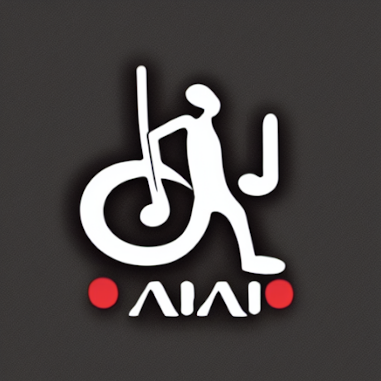

<div id="top"></div>
<!-- PROJECT LOGO -->
<br />
<div align="center">
  <a href="https://github.com/shoolpani-dubey/bajaao">
    
  </a>

<h3 align="center">Bajaaoo - A React Music Player</h3>

  <p align="center">
    Simple to use Music Player where you can create playlist from (local file urls/ youtube/ facebook/ vimeo/ remote file urls/ twitch/ soundCloud/ streamable / vimeo / wistia/ mixcloud/ dailyMotion and Kaltura)
    <br />
    <br />
    <a href="https://bajaaoo.netlify.app/">View Demo</a>
    ·
    <a href="https://github.com/shoolpani-dubey/bajaao/issues">Report Bug</a>
    ·
    <a href="https://github.com/shoolpani-dubey/bajaao/issues">Request Feature</a>
  </p>
</div>

<!-- TABLE OF CONTENTS -->
<details>
  <summary><b>Table of Contents</b></summary>
  <ol>
    <li>
      <a href="#about-the-project">About The Project</a>
      <ul>
        <li><a href="#built-with">Built With</a></li>
      </ul>
    </li>
    <li>
      <a href="#getting-started">Getting Started</a>
      <ul>
        <li><a href="#prerequisites">Prerequisites</a></li>
        <li><a href="#installation">Installation</a></li>
      </ul>
    </li>
    <li><a href="#contributing">Contributing</a></li>
    <li><a href="#license">License</a></li>
    <li><a href="#contact">Contact</a></li>
  </ol>
</details>

<!-- ABOUT THE PROJECT -->

## About The Project

[![Bajaaoo][product-screenshot]](https://bajaaoo.netlify.app/)
I created this project over the weekend to practice React, Typescript and SCSS. It also serves as the default music player to play some lofi music when i am working and where i list my popular youtube urls which I listen to later.


<p align="right">(<a href="#top">back to top</a>)</p>

### Built With

- [React.js](https://reactjs.org/)
- [HTML](https://developer.mozilla.org/en-US/docs/Web/HTML)
- [CSS](https://developer.mozilla.org/en-US/docs/Web/CSS)
- [SCSS](https://sass-lang.com/)
- [Typescript](https://www.typescriptlang.org/)
- [ReactPlayer](https://github.com/cookpete/react-player)

<p align="right">(<a href="#top">back to top</a>)</p>

<!-- GETTING STARTED -->

## Getting Started

Follow these steps to install the project on your local system.

### Prerequisites

Clone the repository

```sh
git clone https://github.com/shoolpani-dubey/bajaao.git
```

### Installation

1. Install the missing npm packages using the following command
   ```sh
   npm install
   ```
2. Start the project from the root of the directory
   ```sh
   npm start
   ```

<p align="right">(<a href="#top">back to top</a>)</p>


## Contributing

Contributions are what make the open source community such an amazing place to learn, inspire, and create. Any contributions you make are **greatly appreciated**.

If you have a suggestion that would make this project better, please fork the repo and create a pull request. You can also simply open an issue with the tag "enhancement".
Don't forget to give the project a star! Thanks again!

1. Fork the Project
2. Create your Feature Branch (`git checkout -b feature/AmazingFeature`)
3. Commit your Changes (`git commit -m 'Add some AmazingFeature'`)
4. Push to the Branch (`git push origin feature/AmazingFeature`)
5. Open a Pull Request

<p align="right">(<a href="#top">back to top</a>)</p>

<!-- LICENSE -->

## License

Distributed under the MIT License. See `LICENSE.txt` for more information.

<p align="right">(<a href="#top">back to top</a>)</p>

<!-- CONTACT -->

## Contact

Shoolpani Dubey's Email - [shool.pani.dubey@gmail.com](mailto:shool.pani.dubey@gmail.com?subject=Github%20%7C%20%3CPlease%20enter%20your%20subject%20here%3E&body=%3CPlease%20Write%20your%20message%20here.%3E) - Click on this link to quickly send an email.

Link: [Live Demo of the Web App](https://bajaaoo.netlify.app/)

<p align="right">(<a href="#top">back to top</a>)</p>

<!-- MARKDOWN LINKS & IMAGES -->
[product-screenshot]: public/Screenshot%202023-05-03%20at%204.09.06%20PM.png